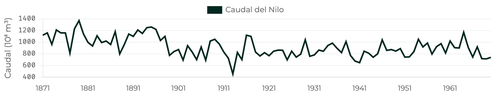
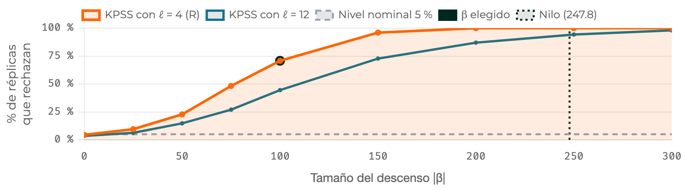
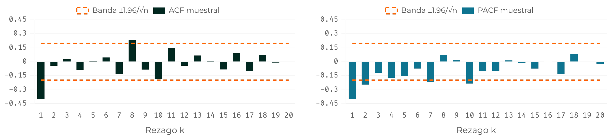
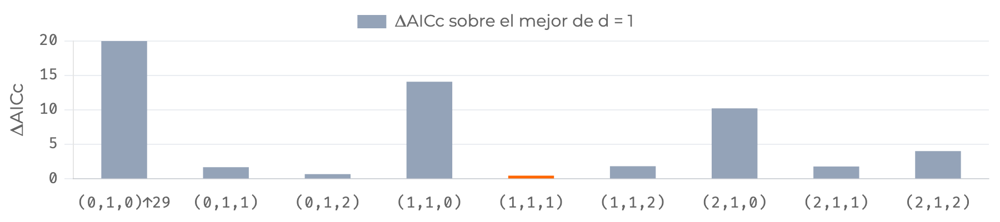
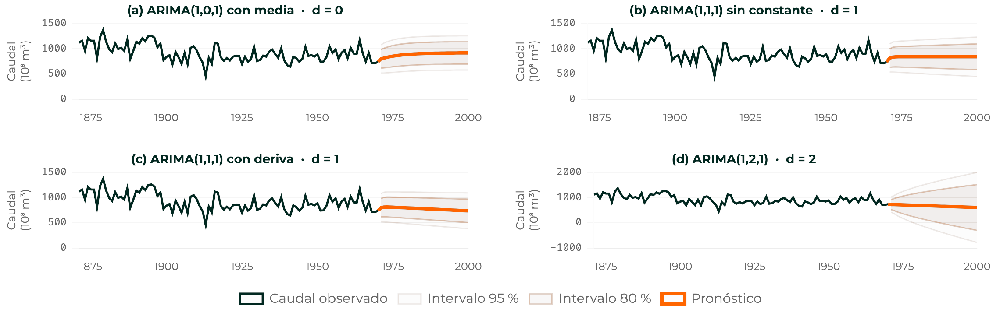
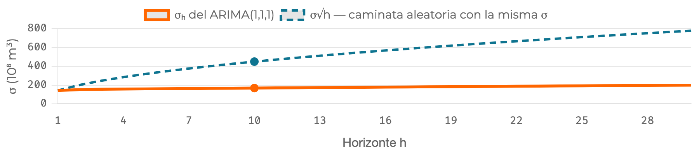
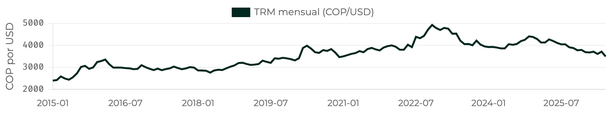
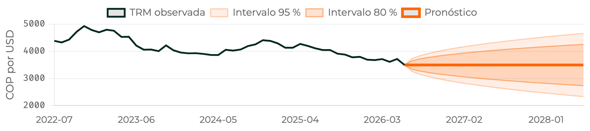
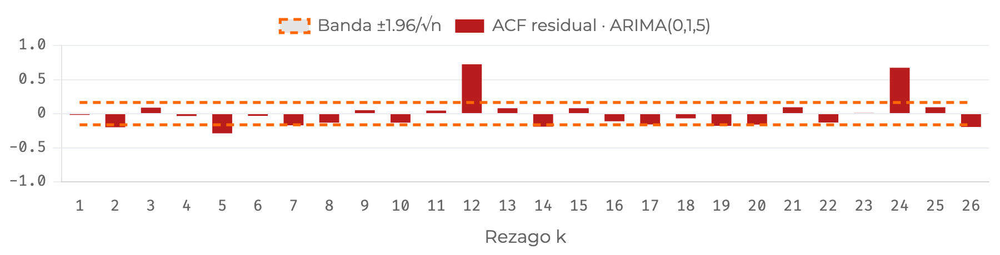

<!--
  Capítulo 4 · Modelos ARIMA y Box–Jenkins.
  Cubre los módulos 1 a 10; el módulo 11 (simulacro del quiz) no se proyecta.
  50 diapositivas: portada, hoja de ruta, la leyenda de etiquetas, 5 divisores y 42 de contenido
  (40 de materia, el cierre y la tarea). A 2–3 min por diapositiva de materia, ≈ 90–120 min.

  Convención de esta presentación (petición del docente):
    · cada afirmación lleva una etiqueta: Dato · Definición · Interpretación · Opinión
    · cada cifra lleva su fuente (J = cap4_arima.json, R = reejecución en R: 4.3.3 y,
      para las cifras añadidas después, 4.6.0; C = capítulo, D = documentación de R,
      A = plan de auditoría)
    · lo que no se pudo contrastar va marcado [SIN VERIFICAR]
  Las cifras se contrastan con `verificacion/verifica_cifras_cap4.py`; el detalle,
  cifra por cifra, está en `verificacion/verificacion_cifras.md`.

  Estructura: la leyenda va antes de la primera sección, sin divisor propio; «Tres series»
  entra en M1–2, justo antes del primer ejemplo con datos; la sección «Fuentes y estado de
  verificación» ya no se proyecta (su contenido está en las notas de la leyenda y de la
  última diapositiva, y el informe sigue enlazado desde ahí).
-->

## Cada afirmación es un dato, una definición, una interpretación o una opinión

Cada afirmación lleva su etiqueta y cada cifra, su fuente: así se distingue lo que se midió de lo que se interpreta.

| Etiqueta | Qué es |
|---|---|
| <kbd>Dato</kbd> | Una cifra calculada sobre una serie concreta; lleva fuente y se contrastó en R |
| <kbd>Definición</kbd> | Una verdad matemática o una convención: no depende de la serie |
| <kbd>Interpretación</kbd> | La lectura que el capítulo hace de los datos: se puede discutir |
| <kbd>Opinión</kbd> | Una recomendación o regla práctica: se defiende, no se demuestra |

<mark>[SIN VERIFICAR]</mark> marca lo que no se pudo contrastar con una fuente: no es un dato confirmado.

<small>Fuentes: **J** = `cap4_arima.json` (R 4.6) · **R** = reejecución en R · **C** = capítulo · **D** = documentación de R · **A** = plan de auditoría</small>

???
Antes de empezar, una regla de juego: cada cifra de la presentación lleva su fuente en la línea pequeña de abajo, y cada afirmación su etiqueta. Lo que no se pudo contrastar lo marca el resaltado «SIN VERIFICAR» y no se debe citar como dato.

Lo que no se pudo contrastar en esta presentación <mark>[SIN VERIFICAR]</mark>: que el descenso del Nilo hacia 1899 se deba a la presa baja de Asuán; que Box y Jenkins usen el signo menos en θ(B) en su libro original; el origen de la TRM en datos.gov.co (solo se comprobó contra la copia congelada del repositorio); y las secciones y capítulos de las lecturas de la última diapositiva. La edición de 1970 de Box y Jenkins sí se confirmó (Shumway y Stoffer la citan).

Verificación: las cifras salen de `precalculo/salidas/cap4_arima.json` (R 4.6, forecast 9.0.2). Para esta presentación se volvió a correr `genera_cap4.R` en R 4.3.3 (forecast 8.21.1) y se recalcularon aparte las cifras que no están en el JSON; las que hacían falta después (p exactos, ranking completo de la búsqueda exhaustiva) salen de `verifica_directo_r46_cap4.R`, en R 4.6.0. La tabla cifra por cifra está en `verificacion/verificacion_cifras.md`, con enlace en la última diapositiva. Las definiciones y equivalencias teóricas se toman del capítulo y de su bibliografía; los libros no estaban a mano y no se contrastaron, salvo dos comprobaciones manuales con página (la edición de 1970 de Box y Jenkins en Shumway y Stoffer, y el signo de θ en Cryer y Chan y en Tsay).

# Módulos 1–2 · El modelo y el método {seccion=modulo-1}

> Los ARMA solo describen series estacionarias. Aquí la diferenciación deja de ser un paso previo y pasa a ser parte del modelo.

???
Gancho: el Capítulo 3 terminó con un límite explícito. Preguntar cómo se hace estacionaria una serie: la respuesta del Capítulo 2 fue diferenciar, pero como preprocesamiento. Hoy se escribe dentro del modelo.

## La diferenciación es parte del modelo, no un preprocesamiento

::: definicion Proceso ARIMA(p,d,q)
$$\phi(B)\,(1-B)^d\,y_t = c + \theta(B)\,\varepsilon_t$$
:::

- \(w_t=\nabla^d y_t\) sigue un ARMA(\(p,q\)) estacionario e invertible
- Son \(d\) raíces **fijadas** en \(B=1\): se imponen, no se estiman
- La **I** es de *integrated*: para volver de \(w_t\) a \(y_t\) se suma \(d\) veces

<small>Fuente: C Módulo 1</small>

???
Lo importante está a la izquierda de la ecuación: el polinomio autorregresivo completo es φ(B)(1−B)^d, de grado p+d, con d raíces exactamente sobre el círculo unitario. Un ARIMA no es un ARMA cualquiera. Transición: ¿qué queda si se multiplican los factores?

Detalle en el material: Módulo 1. Aviso sobre el signo de θ: R (`arima`) escribe θ(B) = 1 + θ₁B + … (D `?arima`, comprobado); statsmodels, según el capítulo, también. Que Box y Jenkins usen el signo menos en su libro original <mark>[SIN VERIFICAR]</mark>: no se tuvo. Sí usan el menos Cryer y Chan (§4.2, con la nota de que R usa el más) y Tsay. Copiar un θ de un libro a R sin mirar el convenio produce otro modelo.

## Un ARIMA(1,1,1) es un ARMA(2,1) con una raíz unitaria impuesta

$$(1-\phi B)(1-B) = 1-(1+\phi)B+\phi B^2$$

<kbd>Definición</kbd> Los coeficientes del ARMA(2,1) son \(\phi_1^{*}=1+\phi\) y \(\phi_2^{*}=-\phi\); su suma es **exactamente 1**: la firma de la raíz unitaria.

::: ejemplo Contexto: el Nilo
<kbd>Dato</kbd> Con \(\hat\phi=0.2544\), el AR del ARIMA(1,1,1) del Nilo (Módulo 6): coeficientes **1.2544** y **−0.2544** (suma **1**); raíces de módulo **1.0000** y **3.93**. Ilustra una raíz *justo* sobre el círculo y da los pesos \(\psi\) del Módulo 9.
:::

<small>Fuente: J `nilo.diagnostico` (ar1) · R recalculado</small>

???
Hacer la multiplicación en el tablero: (1−φB)(1−B) = 1 − (1+φ)B + φB². Las raíces del polinomio son B = 1/φ y B = 1; la segunda cae justo sobre el círculo, así que ese ARMA(2,1) no puede ser estacionario. La suma φ₁*+φ₂* = 1 es la firma.

Verificación: φ̂ = 0.2544 sale del ajuste ARIMA(1,1,1) del Nilo (J). 1.2544, −0.2544, suma 1 y raíces 1.0000 y 3.93 se recalcularon en R (1/φ̂ = 3.93 tanto con φ̂ = 0.2544 como sin redondearlo). Detalle: Módulo 1, derivación.

## Suavizamiento exponencial lineal, caminata y Holt son casos particulares de ARIMA

| Modelo | Nombre | Qué dice |
|---|---|---|
| ARIMA(\(p,0,q\)) | ARMA(\(p,q\)) | Todo el Capítulo 3 |
| ARIMA(\(0,1,0\)) | Caminata aleatoria | \(y_t=y_{t-1}+\varepsilon_t\): el pronóstico es el último valor |
| ARIMA(\(0,1,0\)) con \(c\) | Caminata con deriva | Añade una tendencia lineal |
| ARIMA(\(0,1,1\)) | IMA(1,1) | Equivale al suavizamiento exponencial simple, con \(\alpha=1+\theta\) (signo de R) |
| ARIMA(\(0,2,2\)) | IMA(2,2) | Incluye al método de Holt con tendencia, con restricciones sobre los coeficientes |

<kbd>Definición</kbd> Equivalencias tomadas del capítulo; el capítulo dice «equivale» para Holt, y con más precisión es un caso particular del IMA(2,2). <kbd>Interpretación</kbd> Para esos métodos no hay dos teorías, hay una: los criterios de información, el diagnóstico y los intervalos del capítulo también les sirven.

<small>Fuente: C Módulo 1 (equivalencias no contrastadas con los libros)</small>

???
Es la razón por la que el capítulo importa más de lo que parece: lo que se enseña como recetas independientes son casos de una familia. La caminata aleatoria vuelve en el Módulo 10 (TRM) y como referencia «naïve» en el Capítulo 6.

Verificación: las equivalencias (IMA(1,1) = suavizamiento exponencial simple; IMA(2,2) = Holt) son resultados clásicos que el capítulo enuncia sin demostrar; no se contrastaron con FPP3 ni con Box et al. en esta sesión. Dos precisiones: α = 1 + θ vale con el signo de R y con −1 < θ < 0 (con el signo de Box y Jenkins sería α = 1 − θ), y Holt es un caso particular del IMA(2,2), con restricciones sobre θ₁ y θ₂ (no todo IMA(2,2) es Holt). El «lineal» del título viene del capítulo: los suavizamientos con error o tendencia multiplicativos no son ARIMA.

## Tres series conducen el capítulo, y cada una enseña algo distinto

| Serie | De dónde sale | Qué ilustra |
|---|---|---|
| **Nilo** · caudal anual en Asuán, 1871–1970 (*n* = 100, 10⁸ m³) | `Nile` de R; Cobb (1978) | Cómo elegir \(d\) |
| **TRM** · promedio mensual COP/USD, ene 2015–jun 2026 (*n* = 138) | Superintendencia Financiera vía datos.gov.co, consulta 2026-07-26 <mark>[SIN VERIFICAR]</mark> | El ciclo completo, de la identificación al pronóstico |
| **log(AirPassengers)** · pasajeros mensuales, 1949–1960 (*n* = 144) | `AirPassengers` de R; Box, Jenkins y Reinsel (1994) | Hasta dónde llega un ARIMA sin parte estacional |

<small>«Qué ilustra» es <kbd>Interpretación</kbd> del capítulo. La TRM es una copia congelada: no se cotejó con datos.gov.co. Fuente: J `nilo`, `trm`, `puente_estacional` · R · D `?Nile`, `?AirPassengers`</small>

???
Presentar las tres series una vez, justo antes del primer ejemplo con datos, y no volver a explicarlas: cada diapositiva de ejemplo repite en una línea de qué serie habla. No adelantar aquí lo que cada una revelará. Las series de los ejercicios —BJsales (n = 150) y lynx (1821–1934)— entran más adelante con su propio contexto.

Verificación: los datos del Nilo y de AirPassengers son idénticos a los de `datasets` de R (comprobado). La ayuda de AirPassengers en R 4.6 cita a Box, Jenkins y Reinsel (1994); la de R 4.3.3 decía 1976, un anacronismo, porque Reinsel entró como coautor en la tercera edición. El origen de la TRM (datos.gov.co) no se pudo contrastar: solo se comprobó contra la copia congelada de `precalculo/salidas/datos_series.json` (n = 138, de 2015-01 a 2026-06).

## En el Nilo, diferenciar una vez casi no reduce la varianza

{alto=180}

| \(d\) | \(n\) | Media | Varianza | \(\hat\rho_1\) |
|---|---|---|---|---|
| 0 | 100 | 919.35 | 28 638 | +0.50 |
| 1 | 99 | −3.84 | 28 268 | −0.40 |
| 2 | 98 | −0.14 | 80 055 | −0.63 |

<kbd>Dato</kbd> La varianza baja solo un 1.3 % con \(d=1\) y casi se triplica con \(d=2\). <kbd>Interpretación</kbd> ¿Hacía falta diferenciar? Los Módulos 3 y 8 lo responden.

<small>Contexto: `Nile` (R); diferenciar gana poco si el problema es un escalón (~1899). Fuente: J `nilo.varianzas`, `nilo.identificacion` · R</small>

???
Antes de mover nada, mirar la serie: más que vagar sin rumbo, el nivel cae hacia 1899. Luego leer los números, no solo el gráfico: la media cae a casi cero porque diferenciar convierte el caudal en su cambio anual; la varianza apenas baja con d = 1; ρ̂₁ pasa a −0.63 con d = 2, por debajo de −0.5, el valor que tendría la diferencia de un ruido blanco.

Se puede abrir el simulador en vivo desde el enlace del divisor. La foto es el estado inicial (d = 0). Verificación: media y varianza recalculadas en R; ρ̂₁ y varianza en J. La variación −1.3 % es (28 268.34 − 28 637.95)/28 637.95.

## La aportación de Box y Jenkins fue el método: un ciclo con vueltas atrás

::: flujo
1. **Identificación** — ¿qué orden proponer?
2. **Estimación** — ¿cuánto valen los coeficientes?
3. **Diagnóstico** — ¿sobra estructura?
4. **Uso** — pronosticar y explicar
:::

Las etapas 2, 3 y 4 pueden mandar de vuelta a la identificación.

<kbd>Interpretación</kbd> La familia ya existía; la aportación fue una secuencia de etapas con criterios explícitos y vueltas atrás.

<kbd>Dato</kbd> *Time Series Analysis: Forecasting and Control*, de Box y Jenkins, 1970 (1.ª edición; la revisada es de 1976)

<small>Fuente: C Módulo 2 · D `?BJsales` cita la edición de 1976 · Shumway y Stoffer, *Time Series Analysis and Its Applications*, cita la de 1970</small>

???
La palabra clave es iterativo: no es una receta que se ejecuta una vez de arriba abajo. Solo se llega a pronosticar cuando el diagnóstico no encuentra nada que objetar, y aun entonces la forma del pronóstico puede delatar un d mal elegido.

Verificación: el año 1970 (1.ª edición, Holden-Day) lo cita Shumway y Stoffer (*Time Series Analysis and Its Applications*, 3.ª ed., pp. 8, 15 y 75 del PDF); la documentación de R (`?BJsales`) cita la edición revisada de 1976. Detalle: Módulo 2. El título afirma menos que antes a propósito: Box y Jenkins también sistematizaron el ARIMA y la identificación con ACF y PACF; lo que aportaron sobre todo fue el ciclo.

## Cada etapa tiene un hallazgo que la obliga a devolverse

| Etapa | Qué se hace | Qué obliga a volver |
|---|---|---|
| **1 · Identificación** | \(d\) primero; luego \(p\) y \(q\) en la ACF/PACF de la serie **ya diferenciada** | Residuales con estructura: el orden se quedó corto |
| **2 · Estimación** | Máxima verosimilitud; AICc y BIC dentro del mismo \(d\); revisar raíces | Sin convergencia o error estándar enorme; raíz MA sobre el círculo (bajar \(d\)) o AR (subirlo) |
| **3 · Diagnóstico** | Residuales como ruido blanco: correlograma, Ljung–Box con `fitdf = p + q` | Rechazo, o patrón en múltiplos del período: modelo estacional (Cap. 5) |
| **4 · Uso** | Pronosticar con intervalos | Forma absurda del pronóstico: \(d\) mal elegido |

<kbd>Interpretación</kbd> Reglas de lectura del capítulo.

<small>Fuente: C Módulo 2</small>

???
Pedir que digan, antes de mirar la última columna, qué hallazgo obligaría a volver en cada etapa. Insistir en el orden: primero d y solo después p y q, porque la ACF de una serie no estacionaria no decae y no informa de p y q.

Detalle: Módulo 2, panel de cada etapa del ciclo.

## Si el modelo estimado tiene una raíz MA de módulo 1, ¿se sube o se baja \(d\)? {.pregunta}

Se estimó un ARIMA(0,1,1) y, en la etapa 2, el polinomio MA tiene una raíz sobre el círculo unitario. Usa la tabla anterior: ¿a qué etapa se vuelve y qué se hace con \(d\)?

::: respuesta Se baja \(d\)
<kbd>Interpretación</kbd> Una raíz MA sobre el círculo unitario es la firma de haber diferenciado de más: el MA intenta cancelar el factor \((1-B)\) que se añadió. Si la raíz sobre el círculo fuera la del AR, la lectura sería la contraria: se sube \(d\). Se vuelve de la estimación a la identificación.
:::

<small>Contexto: pregunta sobre el ciclo de Box–Jenkins; el caso completo con datos llega en el Módulo 8. Fuente: C Módulo 2</small>

???
Pedir que lo escriban antes de revelar. Es la fila 2 de la tabla anterior en forma de pregunta: raíz MA sobre el círculo, se baja d; raíz AR, se sube. Transición: el ciclo entero cabe en unas líneas de R.

Detalle: Módulo 2, etapa 2; la sobrediferenciación se demuestra en el Módulo 8.

## El ciclo completo cabe en un esqueleto corto de R {columnas=3:2}

```r Nilo, ciclo de Box–Jenkins {resaltar=2,3-4,6,8}
library(forecast)
d <- ndiffs(Nile)                  # etapa 1
ajuste <- arima(Nile, order = c(1, d, 1),
                method = "ML")     # etapa 2
res <- residuals(ajuste)           # etapa 3
Box.test(res, lag = 20, type = "Ljung-Box", fitdf = 2)$p.value
#> [1] 0.7997371
pron <- forecast(ajuste, h = 10)   # etapa 4
round(as.numeric(pron$mean[1:3]), 2)
#> [1] 816.18 835.56 840.49
```

|||

- <kbd>Dato</kbd> Ljung–Box(20): \(p=0.800\)
- <kbd>Interpretación</kbd> \(p>0.05\): no hay evidencia de estructura sobrante
- <kbd>Dato</kbd> Pronóstico a 1, 2 y 3 años: **816.18**, **835.56** y **840.49** (10⁸ m³)

<small>Contexto: `Nile` (R); muestra las cuatro etapas sobre una sola serie. Fuente: R código ejecutado · J `nilo.diagnostico` · C Módulo 2</small>

???
Es un esqueleto recortado del material: se quitaron el gráfico y los correlogramas de la etapa 1 (`plot(Nile)`, `acf`, `pacf`), y las llamadas a `library(tseries)`. Lo que se proyecta se ejecutó en R 4.3.3 y da exactamente estas salidas. Ojo: la etapa 4 usa el mismo ajuste de la etapa 2, y el orden (1, d, 1) es solo un ejemplo: el orden real se decide en el Módulo 4, donde el candidato es el (0,1,1).

El equivalente en Python está en el material (statsmodels da 0.761 en Ljung–Box: cada programa inicializa el filtro a su manera). Detalle: Módulo 2.

# Módulos 3–4 · Elegir d, p y q {seccion=modulo-3}

> Todo lo demás cuelga de \(d\). Tres evidencias para decidirlo, y una prueba que puede engañar.

???
Un d mal elegido no produce un modelo un poco peor: produce uno cuyos criterios de información no se pueden comparar con los del d correcto, cuyos residuales pueden pasar el diagnóstico igualmente y cuyo pronóstico a largo plazo tiene la forma equivocada.

## Tres evidencias miran la serie desde ángulos distintos

| Evidencia | Qué mirar | Qué dice el Nilo |
|---|---|---|
| **1. El gráfico** | ¿El nivel vaga sin volver? ¿Hay saltos? | Un descenso brusco hacia 1899 |
| **2. La varianza** | \(\operatorname{Var}(\nabla^d y)\) baja y luego sube | 28 638 → 28 268 → 80 055 → 262 507: mínimo en \(d=1\) |
| **3. Las pruebas** | ADF y PP (\(H_0\): raíz unitaria); KPSS (\(H_0\): estacionaria) | ADF −3.366 (\(p=0.064\)), KPSS 0.965 (\(p<0.01\)), PP −6.690 (\(p<0.01\)) |

<kbd>Dato</kbd> ADF y KPSS apuntan a diferenciar; PP rechaza la raíz unitaria. <kbd>Interpretación</kbd> Las tres no coinciden.

<small>Contexto: el Nilo, el caso donde las pruebas discrepan. ADF de `adf.test`: constante y tendencia, \(k=4\). Fuente: J `nilo.varianzas`, `nilo.pruebas` · R recalculado</small>

???
Las pruebas no contrastan lo mismo: ADF y PP parten de la raíz unitaria (PP corrige la autocorrelación de forma no paramétrica); KPSS invierte la hipótesis nula. La caída de la varianza de d = 0 a d = 1 es llamativamente pequeña, un 1.3 %: aviso de que algo no encaja con la historia habitual de la raíz unitaria. El Módulo 8 lo destapa.

Verificación: las cifras de la tabla están en J y se recalcularon en R (adf.test, kpss.test, PP.test). Detalle: Módulo 3. Sobre el PP: con este mismo ARIMA(1,1,1) simulado con raíz unitaria verdadera (1 000 réplicas), `PP.test` rechaza el 100 % de las veces y `adf.test` con k = 4, el 51.3 %; con un MA fuerte y negativo (θ̂ ≈ −0.87) el PP rechaza casi siempre, así que su −6.690 apenas informa.

## Las tres versiones de `ndiffs` no coinciden en el Nilo {columnas=1:1}

```r ndiffs según la prueba {resaltar=2-3}
library(forecast)
sapply(c("kpss", "adf", "pp"),
       function(t) ndiffs(Nile, test = t))
#> kpss  adf   pp
#>    1    0    0
```

- <kbd>Dato</kbd> El valor por defecto de `ndiffs()` —el de `auto.arima()`— es KPSS: la única que dice **1**
- <kbd>Dato</kbd> El ADF de `ndiffs` usa solo constante y un rezago: \(\tau_\mu=-4.05\) frente a \(-2.89\) (5 %), rechaza. El de `adf.test`, con tendencia y \(k=4\), no
- <kbd>Interpretación</kbd> No es un fallo de ninguna función: KPSS invierte la hipótesis nula, y con un MA fuerte y negativo el PP rechaza casi siempre, aun con raíz unitaria

|||

::: warn Comparar salidas entre programas
`tseries::kpss.test` da 0.9654; `statsmodels.kpss`, con su opción por defecto, 0.8691; con `nlags="legacy"`, 0.5497. Es el truncamiento de la varianza de largo plazo, no un error.
:::

<small>Contexto: el Nilo; ilustra que `ndiffs` depende de la prueba y de su especificación. Fuente: J `nilo.pruebas` · R código ejecutado · R statsmodels 0.14.6</small>

???
Dos de las tres pruebas dicen que no hay que diferenciar, y la que usa auto.arima por defecto es la única que dice que sí. Cuando discrepan, la respuesta no está en la prueba sino en el gráfico, y en esta serie hay una razón concreta: el escalón.

Verificación: los tres ndiffs y τμ = −4.05 (crítico −2.89) se recalcularon en R con `urca::ur.df(type = "drift", lags = 1)`. Los tres KPSS de Python, con statsmodels 0.14.6. Detalle: Módulo 3, recuadro «R y Python no calculan el mismo KPSS».

## Ruido blanco puro con un escalón en 1899: ¿con qué frecuencia rechaza KPSS? {.pregunta}

**1 000 series** de ruido blanco (\(n=100\), \(\sigma=127.03\)) con un escalón en la posición 29: **ninguna tiene raíz unitaria.**

::: respuesta
<kbd>Dato</kbd> Sin escalón: **4.8 %**, cerca del 5 % nominal. Con el escalón del Nilo (\(\lvert\beta\rvert=247.8\), 1.95 desviaciones típicas): **100 %**. Con \(\lvert\beta\rvert=100\) (0.79 desviaciones): **70.8 %**.

{alto=230}
:::

<small>Contexto: experimento del Módulo 3 (residuales del Nilo + escalón); ilustra que KPSS rechaza sin raíz unitaria. 4.8 % y 100 %: 1 000 réplicas; 70.8 %: malla de 400. Fuente: J `nilo.cambio_nivel` · R</small>

???
Pedir que lo escriban antes de revelar; la gráfica va dentro de la respuesta a propósito, porque su curva ya contesta. La sospecha: el descenso de 1899 no es una raíz unitaria sino un escalón; una serie estacionaria alrededor de dos niveles no vuelve a una media única, y eso es lo que KPSS detecta como «no estacionariedad».

Verificación: 4.8 % y 100 % (1 000 réplicas, semilla 2026) y 70.8 % (malla de 400 réplicas) están en J y se regeneraron idénticos en R 4.3.3. 247.78/127.03 = 1.95; 100/127.03 = 0.79. La foto es el estado inicial del simulador (|β| = 100). Detalle: Módulo 3.

## KPSS no distingue una raíz unitaria de un cambio de nivel {.idea etiqueta="Interpretación"}

El error está en leer su rechazo como «hay que diferenciar». <kbd>Dato</kbd> El ADF de `adf.test` tampoco se salva: no rechaza la raíz unitaria en el **86.4 %** de las réplicas con escalón, frente al **5.4 %** sin él.

<small>Contexto: mismo experimento del Módulo 3; por ahora \(d=1\) (el de KPSS) es una decisión **provisional** que el Módulo 8 pone a prueba. Fuente: J `nilo.cambio_nivel.monte_carlo` · R</small>

???
Es la frase que deben llevarse del módulo. Con datos suficientes cualquier escalón acaba haciendo rechazar a KPSS: las sumas parciales de los residuales dejan de compensarse. Regla práctica del capítulo (opinión): d casi nunca pasa de 2, y si parece necesario d = 3, antes de subir d conviene volver al gráfico.

Detalle: Módulo 3, derivación de KPSS con un escalón.

## La ACF del Nilo sin diferenciar decae despacio: ¿qué se concluye sobre p y q? {.pregunta}

Los primeros rezagos de la ACF son **0.498**, **0.385**, **0.328** y **0.239**, y no cortan (banda ±0.196, con \(n=100\)).

::: respuesta Nada todavía
<kbd>Interpretación</kbd> Esa forma es compatible con una serie no estacionaria o con un escalón: la tabla de identificación presupone estacionariedad. Leerla como un AR(1) con \(\phi\approx0.5\) es el error de principiante más caro: ese AR(1) daría 0.25 y 0.125 en los rezagos 2 y 3, no 0.385 y 0.328.
:::

<small>Contexto: el Nilo sin diferenciar, para ver por qué \(p\) y \(q\) se leen sobre la serie ya diferenciada. Fuente: J `nilo.identificacion.cruda` · R recalculado</small>

???
Pregunta de la autoevaluación del módulo 4. Un AR estacionario tiene una ACF que decae geométricamente y acaba entrando en la banda; esta tiene los veinte rezagos positivos y 11 fuera de la banda. Lo que se ve no es memoria larga: es un nivel que vaga (o un escalón).

Verificación: 0.4984, 0.3846, 0.3279, 0.2392 y la banda 0.196 en J y en R. 0.5² = 0.25 y 0.5³ = 0.125 son aritmética. Detalle: Módulo 4.

## Sobre ∇Nilo la ACF corta en 1 y la PACF decae: la firma de un MA(1)

{alto=250}

- <kbd>Dato</kbd> Banda ±0.197 (\(n=99\)). ACF: salen el rezago 1 (−0.402) y el 8 (0.231). PACF: salen el 1, el 2, el 7 y el 10, todos negativos
- <kbd>Interpretación</kbd> La ACF corta en 1 y la PACF no corta: decae con signo negativo, como en un MA(1). El rezago 8 es aislado y sin patrón: con 20 rezagos al 5 %, uno fuera es lo esperable

<small>Contexto: el Nilo diferenciado una vez; ilustra la firma de un MA(1) en la ACF y la PACF. Fuente: J `nilo.identificacion.d1` · R</small>

???
Con d = 1 el resto es el Capítulo 3 sin cambios: ACF y PACF sobre la serie ya diferenciada. La ACF corta en 1 y la PACF decae con signo negativo, como la de un MA(1) con θ < 0. La PACF sale de la banda en cuatro rezagos (1, 2, 7 y 10), todos negativos: decae, pero con ruido; los rezagos 7 y 10 no cambian la lectura. La banda ±1.96/√n es la del ruido blanco; para la ACF de un MA(1) más allá del rezago 1 la de Bartlett es algo más ancha (±0.227) y el rezago 8 sigue fuera por poco.

Verificación: banda, ρ̂₁ = −0.402, rezago 8 = 0.2312 y PACF en J y en R. Las fotos son el estado inicial del simulador (d = 1), con el eje y recortado a ±0.45 para que se distingan las barras que salen de la banda (el simulador y el capítulo usan ±1). Detalle: Módulo 4.

## La tabla propone un ARIMA(0,1,1), pero se llevan varios candidatos, no uno

| | ACF | PACF | Sugiere |
|---|---|---|---|
| AR(\(p\)) | decae | corta en \(p\) | ARIMA(\(p,d,0\)) |
| MA(\(q\)) | **corta en \(q\)** | **decae** | ARIMA(\(0,d,q\)) |
| ARMA(\(p,q\)) | decae | decae | hay que probar |
| **∇Nilo** | corta en 1 (−0.402) | decae | **ARIMA(\(0,1,1\))** |

- <kbd>Dato</kbd> \(\hat\theta=-0.7329\) (e.e. 0.1143, \(t=-6.41\)); Ljung–Box(20): \(p=0.674\). El AICc prefiere el (1,1,1) por 1.71 puntos (menos de 2: no distingue); el BIC, el (0,1,1)
- <kbd>Opinión</kbd> Llevar a la estimación el candidato de la tabla y sus vecinos: (0,1,1), (1,1,1), (0,1,2) y (1,1,0)

<small>Contexto: el Nilo; ilustra cómo se aplica la tabla de identificación del Capítulo 3. Fuente: J `nilo.rejilla` · R</small>

???
La tabla acota la búsqueda, no la resuelve: con n = 99 la banda es ancha y un rezago en el borde puede ser ruido o señal. Que el AICc y el BIC no coincidan es frecuente, no un fallo. Transición: antes de estimar queda una decisión que la ACF no resuelve, la constante.

Verificación: θ̂, e.e., Ljung–Box y ΔAICc en J y en R; t = −0.7329/0.1143 = −6.41. Detalle: Módulo 4.

# Módulos 5–7 · Constante, estimación y auto.arima {seccion=modulo-5}

> Con \(d\) y los candidatos decididos quedan tres cosas: qué significa la constante, con qué criterio comparar y qué hace `auto.arima` por ti.

???
La constante es el parámetro que más confusión causa de toda la familia, porque significa cosas distintas según d y porque cada programa la llama de una manera.

## La constante \(c\) significa cosas distintas según \(d\)

::: definicion Qué es c en cada caso
$$\mu_w=\operatorname{E}\!\left[(1-B)^d y_t\right]=\frac{c}{\phi(1)}$$

- \(d=0\): la **media** de la serie (R la llama `intercept`)
- \(d=1\): el incremento medio por período, una tendencia lineal: la **deriva** (*drift*)
- \(d=2\): una aceleración media, una tendencia cuadrática
:::

Cada diferencia sube en un grado el polinomio de tendencia que genera la constante. <kbd>Opinión</kbd> Con \(d=2\) «prácticamente nunca se quiere».

<small>Fuente: C Módulo 5</small>

???
Regla mnemotécnica: cada diferencia sube en un grado el polinomio de la tendencia. Sin constante, d = 0 tiende a cero, d = 1 se queda plano y d = 2 sigue una recta; con constante, d = 0 vuelve a la media, d = 1 recta y d = 2 parábola. El simulador «La forma del pronóstico según d» del Módulo 9 dibuja cuatro de esos seis casos.

Detalle: Módulo 5. Ojo con el nombre: lo que R devuelve como `intercept` o `drift`, y statsmodels como `const` o `x1`, es μ_w (el promedio de la serie diferenciada), no c; c = μ_w·φ(1).

## Cada programa trata la constante a su manera

| Función | Por defecto | Con \(d\ge1\) |
|---|---|---|
| `stats::arima` | `include.mean = TRUE` | Se ignora en silencio: no hay constante |
| `forecast::Arima` | `include.mean = TRUE` (con \(d=0\)); `include.drift = FALSE` | Con \(d\ge2\) avisa y no la ajusta |
| `forecast::auto.arima` | Prueba con y sin deriva si \(d=1\) | Con \(d\ge2\) nunca la incluye |
| `statsmodels` ARIMA | `trend="c"` si \(d=0\), `"n"` si \(d>0\) | `trend="t"` da deriva con \(d=1\); con \(d\ge2\), `ValueError` |

<kbd>Dato</kbd> Comportamiento comprobado en R 4.3.3 (forecast 8.21.1) y statsmodels 0.14.6. <kbd>Opinión</kbd> Si un `arima()` y un `auto.arima()` no coinciden, lo primero que hay que mirar no son los órdenes sino si uno lleva deriva y el otro no.

<small>Contexto: probado sobre el Nilo; ilustra por qué dos programas dan modelos distintos con el mismo orden. Fuente: R ejecutado · C Módulo 5 (cita R 4.6, forecast 9.0.2)</small>

???
Es un comportamiento de software, no una ley matemática: puede cambiar entre versiones. Se comprobó que con d = 1 `arima()` devuelve solo ar1 y ma1 pese a include.mean = TRUE, que `Arima(..., d = 2, include.drift = TRUE)` avisa «No drift term fitted as the order of difference is 2 or more» y que statsmodels lanza ValueError con trend = "t" y d = 2.

Detalle: Módulo 5, tabla de valores por defecto.

## El Nilo no lleva deriva: no es significativa y el AICc empeora

| Serie | \(\hat\delta\) | e.e. | \(t\) | AICc con deriva | AICc sin deriva |
|---|---|---|---|---|---|
| **Nilo**, ARIMA(1,1,1) | −2.883 | 2.017 | −1.43 | 1268.06 | 1267.51 |
| **TRM**, ARIMA(0,1,0) | 8.00 pesos/mes | 10.36 | 0.77 | 1707.41 | 1705.94 |

- <kbd>Dato</kbd> Media de las diferencias del Nilo: \((740-1120)/99=-3.84\). Solo cuentan el primer y el último año
- <kbd>Interpretación</kbd> Si el escalón de 247.8 fuera la única caída, aportaría \(-2.50\) a esa media; con \(d=1\), un cambio de nivel único solo entra como choque o repartido en pendiente
- <kbd>Opinión</kbd> Una deriva estimada es una tendencia que se extrapola sin límite: conviene no afirmarla a la ligera

<small>Contexto: dos series con una tendencia que «se ve» y no es significativa. Fuente: J `nilo.formas_pronostico`, `trm.deriva` · R recalculado</small>

???
El Nilo: no hay razón física para creer que el caudal disminuya indefinidamente a razón de 2.9 × 10⁸ m³ por año. La TRM: a ojo la serie «claramente sube», pero con n = 138 la deriva no es distinguible de cero; en un ARIMA(0,1,0) δ̂ = (y_n − y₁)/(n − 1) depende solo del primer y del último mes.

Verificación: δ̂, e.e., t y AICc del Nilo y de la TRM en J y recalculados en R (Nilo: −2.8827, 2.0167, −1.429; TRM: 8.0009, 10.3559, 0.773). (740 − 1120)/99 y −247.78/99 son aritmética sobre los datos. Detalle: Módulo 5.

## El AICc solo compara modelos con el mismo d

$$\begin{aligned}\mathrm{AIC}&=-2\log L+2k, \qquad \mathrm{BIC}=-2\log L+k\log n^{*}\\ \mathrm{AICc}&=\mathrm{AIC}+\frac{2k(k+1)}{n^{*}-k-1}\end{aligned}$$

<kbd>Definición</kbd> Con \(k=p+q+1\) (más uno si hay constante o deriva) y \(n^{*}=n-d\) el **número efectivo** de observaciones.

::: warn Atención
La verosimilitud de un ARIMA con \(d=1\) se calcula sobre las **99** diferencias del Nilo; la de uno con \(d=2\), sobre **98** segundas diferencias. Son datos distintos: un AICc menor con más diferencias no es un modelo mejor.
:::

<small>Contexto: el Nilo (\(n=100\)); ilustra cómo baja \(n^{*}\) con \(d\). Fuente: J `nilo.varianzas` (`n_efectivo`) · C Módulo 6</small>

???
Por eso las tablas del capítulo agrupan por d. Cuando de verdad haya que decidir entre distintos d, la comparación válida es fuera de muestra (Módulo 8), apoyada en las pruebas de raíz unitaria y en el criterio sustantivo de qué proceso genera los datos.

Detalle: Módulo 6.

## AICc 1267.51 con un ARIMA(1,1,1) y 1264.60 con un ARIMA(1,2,2): ¿cuál eliges? {.pregunta}

Sobre la misma serie de \(n=100\).

::: respuesta Ninguno, por esta comparación
<kbd>Interpretación</kbd> No son comparables: el primero se calcula sobre 99 observaciones efectivas y el segundo sobre 98. Además, el ARIMA(1,2,2) tiene una raíz MA en **1.03**, casi sobre el círculo unitario. Para decidir entre distintos \(d\): pruebas de raíz unitaria, gráfico o evaluación fuera de muestra.
:::

<small>Contexto: son los mejores de \(d=1\) y \(d=2\) en la rejilla de 27 modelos del Nilo; ilustran la trampa central del AICc. Fuente: J `nilo.mejor_por_d`, `nilo.rejilla` · R</small>

???
Pregunta de la autoevaluación del módulo 6, la trampa central del capítulo. Error frecuente: elegir el (1,2,2) porque 1264.60 < 1267.51; otro, decir que el BIC sí es comparable entre distintos d: tiene exactamente el mismo problema.

Verificación: 1267.51, 1264.60 y n* en J y R; raíz MA 1.0316 en J. Detalle: Módulo 6.

## Cada d se compara solo consigo mismo: el mínimo global es una trampa

| \(d\) | \(n^*\) | Mejor por AICc | Mejor por BIC |
|---|---|---|---|
| 0 | 100 | ARIMA(1,0,1) — 1282.50 | ARIMA(1,0,1) — 1292.50 |
| 1 | 99 | ARIMA(1,1,1) — 1267.51 | ARIMA(0,1,1) — 1274.28 |
| 2 | 98 | ARIMA(1,2,2) — 1264.60 | ARIMA(0,2,2) — 1273.50 |

{alto=185}

- <kbd>Dato</kbd> El ARIMA(0,2,2), mejor por BIC con \(d=2\), tiene \(\lvert\text{raíz MA}\rvert=1.000\): no es invertible

<small>Contexto: los 27 modelos del Nilo, \(p,d,q\in\{0,1,2\}\). Fuente: J `nilo.mejor_por_d`, `nilo.rejilla` · R</small>

???
Opinión (del capítulo): para pronosticar se recomienda el AICc, y si AICc y BIC no coinciden, decirlo. El BIC penaliza cada parámetro con log n* en vez de 2, así que con n* = 99 es más de dos veces más severo (log 99 = 4.6) y tiende a modelos más pequeños. El AICc apunta a minimizar el error de pronóstico; el BIC, a identificar el modelo verdadero si está entre los candidatos.

Verificación: los seis valores de la tabla en J y R (el capítulo imprime la misma tabla); raíz MA del (0,2,2) = 1.0000 en J. La foto es el estado inicial del simulador (d = 1): cuatro modelos a menos de 2 puntos del mejor. Detalle: Módulo 6.

## `auto.arima` es un algoritmo con reglas explícitas, no una caja negra

::: flujo
1. **Elegir \(d\)** con pruebas KPSS sucesivas: se diferencia mientras KPSS rechace la estacionariedad
2. **Ajustar modelos iniciales**: (2,\(d\),2), (0,\(d\),0), (1,\(d\),0) y (0,\(d\),1), con constante si \(d\le1\), y (0,\(d\),0) sin constante
3. **Buscar en el vecindario**: \(p\) y \(q\) en ±1, con o sin constante; lo que mejora el AICc reinicia la búsqueda
4. **Parar** cuando ninguna variante mejora
:::

<kbd>Dato</kbd> Los ajustes con alguna raíz ARMA de módulo < 1.01 se descartan (su criterio de selección pasa a ∞). En el Nilo, el ARIMA(2,1,2) ajustado con `Arima()` tiene una raíz AR de módulo **≈ 1.001**. La búsqueda escalonada evalúa **18** modelos; la exhaustiva, **42**.

<small>Contexto: el algoritmo de Hyndman y Khandakar (2008), sobre el Nilo. Fuente: C Módulo 7 · J `nilo.hyndman_khandakar` · D `citation("forecast")`</small>

???
Conviene entenderlo por dos razones opuestas: funciona sorprendentemente bien, y no es una búsqueda exhaustiva. Con n > 150 o frecuencia mayor que 12 usa además una verosimilitud aproximada (CSS); con las 100 observaciones del Nilo no se activa.

Verificación: los 18 y 42 modelos en J y R. La raíz AR del (2,1,2) se recalculó en R: 1.0008 sin deriva y 1.0005 con deriva en R 4.3.3, y 1.0009 en ambos casos en R 4.6 (`Arima`, CSS-ML; depende del optimizador); con `arima(method = "ML")` sale 2.24, así que la cifra depende del estimador. La regla «raíz < 1.01 ⇒ criterio = ∞» (lo que se pone a ∞ es el criterio de selección, no el AICc del ajuste; se aplica a las raíces del ARMA, no a las d unitarias impuestas) y `approximation` para n > 150 o frecuencia > 12 se comprobaron en el código de `forecast`. El año 2008 y la referencia salen de `citation("forecast")` (D): Journal of Statistical Software, doi 10.18637/jss.v027.i03 (el texto de R imprime el volumen 26, pero el DOI corresponde al 27, que es el que cita el capítulo). Detalle: Módulo 7.

## Siete modelos quedan a menos de 2 puntos de AICc: el ganador no está solo

| Puesto | Modelo | AICc | Diferencia con el primero |
|---|---|---|---|
| 1.º | ARIMA(1,1,1) | 1267.507 | — |
| 2.º | ARIMA(1,1,1) con deriva | 1268.063 | +0.56 |
| 3.º | ARIMA(0,1,2) | 1268.210 | +0.70 |
| 4.º | ARIMA(0,1,2) con deriva | 1268.969 | +1.46 |
| 5.º | ARIMA(0,1,1) | 1269.216 | +1.71 |
| 6.º | ARIMA(2,1,1) | 1269.322 | +1.81 |
| 7.º | ARIMA(1,1,2) | 1269.348 | +1.84 |

- <kbd>Interpretación</kbd> Entre los siete está el (0,1,1) del correlograma; `auto.arima` devuelve un solo ganador y no lo dice: `trace = TRUE` lo enseña

<small>Contexto: el Nilo, búsqueda exhaustiva (`stepwise = FALSE`). Fuente: J `nilo.hyndman_khandakar` · R</small>

???
Pregunta de la autoevaluación del módulo 7: «auto.arima devuelve el (1,1,1) con 1267.507 y el quinto tiene 1269.216, ¿qué se concluye?». Respuesta: que hay varios modelos prácticamente indistinguibles y conviene decirlo en vez de presentar un único ganador. Ojo: el capítulo y su autoevaluación se detienen en el quinto (a 1.71 puntos); con la misma regla de 2 puntos, la búsqueda exhaustiva deja siete, y los dos que faltan son el (2,1,1) y el (1,1,2). Opinión (regla de referencia habitual): diferencias menores que 2 «no distinguen modelos». Tres cosas que auto.arima no hace: no mira el gráfico (elige d con KPSS), no garantiza el óptimo (explora un vecindario) y no sabe si el modelo tiene sentido.

Verificación: los cinco primeros AICc y sus diferencias en J y R; el 6.º y el 7.º y las diferencias con todos los decimales, en `verifica_directo_r46_cap4.R` (R 4.6, 42 modelos evaluados, 7 a menos de 2 puntos). Detalle: Módulo 7.

# Módulos 8–9 · Diagnóstico y pronóstico {seccion=modulo-8}

> Un modelo puede pasar todo el diagnóstico de residuales y aun así estar diferenciando de más.

???
El ARIMA(1,1,1) del Nilo pasa con holgura Ljung–Box(20) (p = 0.800) y Shapiro (p = 0.731), y ahí terminaría el capítulo si el diagnóstico se agotara en los residuales. No se agota.

Verificación: p = 0.800 en J y R; Shapiro 0.731 en J (`nilo.diagnostico`).

## Diferenciar de más deja una firma algebraica en el MA

Si \(w_t=\nabla y_t\) ya es ruido blanco, una diferencia más produce un MA(1) con \(\theta=-1\): $$\nabla^2y_t=(1-B)\,w_t=\varepsilon_t-\varepsilon_{t-1}$$

| \(d\) | Var(\(\nabla^d y\)) | \(\hat\rho_1\) | \(\hat\theta\) de un MA(1) | Lectura |
|---|---|---|---|---|
| 0 | 28 638 | 0.498 | 0.378 | Sin diferenciar |
| 1 | 28 268 | −0.402 | −0.733 | Mínimo de varianza |
| 2 | 80 055 | −0.626 | **−1.000** | Raíz unitaria en el MA |
| 3 | 262 507 | −0.719 | **−1.000** | Peor todavía |

<kbd>Dato</kbd> En la rejilla del Módulo 6, cuatro de los nueve modelos con \(d=2\) tienen \(\lvert\text{raíz MA}\rvert=1.000\): (0,2,1), (0,2,2), (1,2,1) y (2,2,1).

<small>Contexto: el Nilo diferenciado 0 a 3 veces; ilustra la firma \(\hat\theta\to-1\). La fórmula es <kbd>Definición</kbd>. Fuente: J `nilo.sobrediferenciacion`, `nilo.rejilla` · R</small>

???
No es una metáfora, es álgebra, y se ve en el número: con θ̂ = −1 el MA(1) ajustado sobre ∇²y da σ̂² = 28 268.34, exactamente Var(∇y): el modelo recuperó la serie con una sola diferencia. La rejilla no solo premia modelos con un d equivocado: premia los que son numéricamente degenerados. Matiz: la igualdad ∇²y = ε_t − ε_{t−1} es exacta solo si ∇y es ruido blanco; con ρ̂₁ = −0.626 o −0.719, θ̂ = −1 es además la frontera del MA(1), porque |ρ₁| ≤ 0.5 para cualquier MA(1).

Verificación: la tabla completa en J (`sobrediferenciacion`) y los cuatro modelos degenerados en `rejilla` (raíces MA). La tabla del capítulo rotula d = 1 «Mínimo de varianza. Correcto.»; aquí se dejó solo «Mínimo de varianza» porque el propio Módulo 8 dice que ese mínimo es por poco margen. Detalle: Módulo 8.

## El escalón de 1899 ajusta casi 25 puntos de AICc mejor que cualquier ARMA del Nilo

$$y_t=\mu+\beta\,\mathbf 1\{t\ge1899\}+\varepsilon_t$$

- <kbd>Dato</kbd> \(\hat\beta=-247.78\) (e.e. 28.15, \(t=-8.80\)): la media pasa de 1097.75 a 849.97
- <kbd>Dato</kbd> AICc 1257.91 frente a 1282.50 del mejor ARMA sin escalón: casi 25 puntos, **dentro de \(d=0\)**. Ljung–Box(20): \(p=0.812\)
- <kbd>Interpretación</kbd> El ARIMA(1,1,1) probablemente diferencia una serie sin raíz unitaria, y su \(\hat\theta=-0.874\) es el modelo intentando deshacerlo. El año 1899 sale de los mismos datos (Cobb, 1978): ni el AICc ni el \(t\) lo descuentan
- <kbd>Interpretación</kbd> Posible causa: el descenso coincide en fecha con la construcción de la presa baja de Asuán <mark>[SIN VERIFICAR]</mark>

<small>Contexto: el mismo Nilo, ahora con un escalón como alternativa a la raíz unitaria (Cobb, 1978; `?Nile` habla de un cambio «cerca de 1898»). Fuente: J `nilo.cambio_nivel`, `nilo.diagnostico` · R recalculado</small>

???
Es la explicación única de tres piezas: en el Módulo 1 integrar el ARMA del Nilo casi no cambia la varianza (razón 1.006, frente a 32.8 sin el término MA) porque θ = −0.874 está cerca de −1; en el Módulo 3, dos de tres pruebas dicen que no hay que diferenciar y KPSS rechaza el 100 % con un escalón; aquí, el escalón. Box–Jenkins no tiene una etapa para «detectar intervenciones»: la absorbe subiendo d. Los 25 puntos comparan el escalón con el mejor ARMA (d = 0), no con la raíz unitaria: contra el ARIMA(1,1,1) no son comparables, y la diapositiva siguiente lo resuelve fuera de muestra.

Verificación: β̂, e.e., t, medias, AICc y Ljung–Box en J y recalculados en R. La presa de Asuán no se pudo confirmar con ninguna fuente de esta sesión: la Presa Baja se construyó hacia 1898–1902, así que la coincidencia en fecha es plausible, pero `?Nile` solo habla de un «cambio aparente cerca de 1898» y no dice que la presa lo explique. Observación para el docente: `?Nile` dice «cambio aparente cerca de 1898» y el capítulo usa 1899 (posición 29) como primer año del nuevo nivel; no es un error, pero conviene decirlo así. Detalle: Módulo 8.

## El escalón gana casi 25 puntos de AICc: ¿pronostica mejor fuera de muestra? {.pregunta}

Se ajusta con los primeros 80 años del Nilo y se pronostican los 20 siguientes. Se comparan el ARIMA(1,1,1), el escalón, la media y el naïve (el último valor).

::: respuesta No: gana el más simple
<kbd>Interpretación</kbd> Una ventaja de ajuste dentro de muestra no se traduce automáticamente en capacidad de pronóstico. Fuera de muestra, la comparación entre distintos \(d\) sí es válida.
:::

<small>Contexto: el Nilo, escalón frente a raíz unitaria. Fuente: J `nilo.cambio_nivel` · R</small>

???
Pedir que lo escriban antes de revelar. El AICc de los dos ajustes no era comparable (distinto d); el error de pronóstico fuera de muestra sí lo es. La tabla de la diapositiva siguiente responde.

Detalle: Módulo 8.

## Fuera de muestra el escalón no pronostica mejor: gana el naïve

| Modelo | RMSE | MAE |
|---|---|---|
| Naïve (el último valor) | 123.06 | 101.95 |
| ARIMA(1,1,1) | 125.05 | 106.16 |
| Escalón 1899 (\(d=0\)) | 127.99 | 106.99 |
| Escalón 1899 + AR(1) | 128.31 | 107.40 |
| Media del entrenamiento (1871–1950) | 133.31 | 108.01 |

- <kbd>Dato</kbd> Entrenamiento 1871–1950 (80 años) y pronóstico a 20 años. Los RMSE van de 123 a 133; la desviación típica de los residuales del ARIMA(1,1,1) es 139.67
- <kbd>Interpretación</kbd> Una ventaja de ajuste dentro de muestra no se traduce automáticamente en capacidad de pronóstico. Ninguna diferencia es grande

<small>Contexto: única comparación válida entre modelos con distinto \(d\). Fuente: J `nilo.cambio_nivel.fuera_muestra` · R recalculado</small>

???
El modelo del escalón dominaba dentro de muestra por 25 puntos de AICc y aquí no pronostica mejor; gana el más simple. No sobreinterpretar: la conclusión no es «el naïve es mejor». Medir esto con seriedad —con más de un origen y preguntándose si la diferencia es significativa— es el Capítulo 6.

Verificación: RMSE y MAE en J (regenerados idénticos en R 4.3.3); 139.67 es la desviación típica de los 100 residuales del ARIMA(1,1,1), recalculada en R. Detalle: Módulo 8.

## La regla de la varianza es un aviso, no un teorema: en log(lynx) falla

| \(d\) | 0 | 1 | 2 | 3 |
|---|---|---|---|---|
| Var(\(\nabla^d\log y\)) | 1.653 | 0.687 | 0.603 | 1.153 |

- <kbd>Dato</kbd> Diferenciar **reduce** la varianza un 58 % (1.653 → 0.687) y el mínimo está en \(d=2\); aun así KPSS (\(p>0.10\)) y ADF (\(p<0.01\)) coinciden en \(d=0\)
- <kbd>Dato</kbd> Lo que sí delata la diferencia de más: el ARIMA(2,1,1) tiene \(\lvert\text{raíz MA}\rvert=1.000\)
- <kbd>Interpretación</kbd> Un ciclo no es una tendencia: una serie que sube y baja con regularidad vuelve a su media. Hay que mirar siempre las raíces

<small>Contexto: capturas anuales de lince canadiense, 1821–1934 (\(n=114\)), con un ciclo de unos 10 años; es el ejercicio 2 del capítulo. Fuente: R código ejecutado sobre `lynx` (Brockwell y Davis, 1991, según `?lynx`) · C Ejercicio 2</small>

???
En el Nilo la regla funcionó (la varianza subió al pasarse de d = 1); aquí no. En una serie con oscilación fuerte la diferencia primera atenúa las oscilaciones lentas y eso baja la varianza aunque sobre. Es el ejercicio 2 del capítulo: al proyectarlo se adelanta su respuesta, así que conviene pedirles que reproduzcan el cálculo (varianzas, KPSS, ADF y raíces). Nota honesta del propio ejercicio: el AR(2) sin diferenciar tampoco pasa Ljung–Box (p = 0.0094) y auto.arima propone un ARMA(2,3); la dinámica del lince es más rica que un AR(2), pero eso no cambia la respuesta sobre d.

Verificación: las cuatro varianzas, el 58 %, KPSS y ADF (sus p son las cotas de la tabla de tseries: p mayor que 0.10 y menor que 0.01), la raíz MA 1.0000 del (2,1,1) y el periodo de 9.78 años del AR(2) se recalcularon en R sobre `lynx`. Detalle: Módulo 8, advertencia y Ejercicio 2.

## La forma del pronóstico a largo plazo la deciden \(d\) y la constante

{alto=345}

<kbd>Interpretación</kbd> Los coeficientes ARMA gobiernan los primeros pasos; a largo plazo solo quedan \(d\) y la constante.

<small>Contexto: el Nilo; los cuatro modelos de la tabla siguiente. Fuente: J `nilo.formas_pronostico` · simulador del Módulo 9</small>

???
Antes de la tabla, mirar la forma y pedir que digan cuál es cuál: con d = 0 vuelve a la media; con d = 1 sin constante se queda plana en el último nivel; con deriva sigue una recta; con d = 2 también una recta, pero con un intervalo mucho más ancho.

Las fotos vienen del simulador «La forma del pronóstico según d» del Módulo 9, con h = 30, un panel por modelo; cada panel tiene su propio eje y (el del (d) es más amplio porque su intervalo es mucho más ancho). Detalle: Módulo 9.

## Con \(d=2\) el intervalo a 30 años es 3.5 veces más ancho, y aquí no se justifica

| Modelo (Nilo) | Forma a largo plazo | \(\nabla\hat y\) en \(h=30\) | Ancho 95 %, \(h=1\to30\) |
|---|---|---|---|
| ARIMA(1,0,1) con media | Vuelve a la media | 0.25, tiende a 0 | 561 → 677 |
| ARIMA(1,1,1) sin constante | **Constante** en el último nivel | 0.00 | 557 → 781 |
| ARIMA(1,1,1) con deriva | **Recta** de pendiente \(\hat\delta\) | −2.88 | 555 → 708 |
| ARIMA(1,2,1) | **Recta**, no parábola | −4.05 | 613 → **2771** |

<kbd>Interpretación</kbd> Un intervalo más ancho no delata por sí solo un \(d\) equivocado: es el precio de imponer una raíz más. Aquí no se justifica: el ARIMA(1,2,1) tiene \(\hat\theta=-1\), el modelo sobrediferenciado del Módulo 8.

<small>Contexto: el Nilo, pronóstico a 30 años; ilustra que \(d\) y la constante fijan la forma. Fuente: J `nilo.formas_pronostico`, `nilo.intervalos.forma_medida` · R</small>

???
Los coeficientes ARMA gobiernan los primeros pasos; a partir de cierto horizonte se agotan y lo único que queda en pie es d y la constante. Con d = 2 el pronóstico es una recta y no una parábola: la segunda diferencia decae como φ̂^h (φ̂ = −0.39) y a h = 30 ya es nula; para obtener una parábola haría falta una constante, y `Arima` se niega. Ese ARIMA(1,2,1) tiene θ̂ = −1: es el modelo sobrediferenciado del Módulo 8.

Verificación: ∇ŷ y los anchos en J (`forma_medida`, medidos, no recordados). 2771/781 = 3.55 frente al ARIMA(1,1,1) sin constante (frente al de deriva, 2771/708 = 3.9). El simulador del Módulo 9 dibuja los cuatro casos sobre el Nilo. Detalle: Módulo 9.

## El ancho del intervalo sale de los pesos ψ de la representación MA(∞)

$$\sigma_h^2=\sigma^2\sum_{j=0}^{h-1}\psi_j^2,\qquad \hat y_{T+h\mid T}\pm z_{1-\alpha/2}\,\sigma_h$$

En el ARIMA(1,1,1): \(\psi_j=\dfrac{(1+\theta)-(\phi+\theta)\,\phi^{\,j}}{1-\phi}\to\psi_\infty=\dfrac{1+\theta}{1-\phi}\)

- <kbd>Definición</kbd> \(\psi_0=1\): a un paso el intervalo lo fija solo \(\sigma\). Como \(\psi_j^2\ge0\), \(\sigma_h\) **nunca decrece** con el horizonte
- <kbd>Definición</kbd> Con \(d=1\), \(\psi_j\) tiende a una constante y \(\sigma_h\) crece como \(\sqrt h\); con \(d=2\), como \(h^{3/2}\), salvo que \(\theta(1)=0\): una raíz unitaria en el MA cancela una diferencia
- <kbd>Dato</kbd> En el Nilo, \(\psi_\infty=0.1688\); con estos pesos se reconstruyen los intervalos de `forecast()` con un error máximo del orden de \(10^{-10}\)

<small>Contexto: el Nilo, ARIMA(1,1,1). Fuente: J `nilo.intervalos` · R regenerado · C Módulo 9</small>

???
El intervalo no es un adorno del software: se deduce de los pesos ψ de la representación MA(∞) del Capítulo 3. Con d ≥ 1 la suma no converge si se lleva al infinito, pero basta separar lo que ya se conoce en T de lo que aún no ocurrió. La derivación completa, en seis pasos, está en el Módulo 9. «Cancelar» se entiende como raíz unitaria exacta en el MA, θ(1) = 0, y vale con d = 1 (σ_h queda acotada) y con d = 2; con un θ̂ cercano a −1, como el del Nilo, solo cambia la constante de σ_h, no su ritmo de crecimiento.

Verificación: ψ∞ = 0.1688 y el error de reconstrucción (9.08 × 10⁻¹¹ en la corrida publicada) están en J; ese error es ruido de coma flotante y varía con la versión, por eso se cita solo su orden.

## A 30 años, la incertidumbre del Nilo es casi cuatro veces menor que la de una caminata

{alto=180}

| Serie, ARIMA(1,1,1) | \(\psi_\infty\) | \(\sigma_h\) frente a la caminata |
|---|---|---|
| **Nilo** | 0.169 | \(\sigma_{30}=199.4\) frente a 778.0: casi 4 veces menos |
| **BJsales** | 2.99 | \(\sigma_{12}\) es 1.96 veces el de una caminata |

<kbd>Interpretación</kbd> Con \(\hat\theta=-0.874\) el MA cancela casi toda la integración: los choques casi no se acumulan. En BJsales ocurre lo contrario.

<small>Contexto: BJsales (\(n=150\)) es el ejercicio 3, como contraste. Fuente: J `nilo.intervalos` · R sobre `BJsales`</small>

???
El cociente entre σ_h y σ√h decrece con el horizonte y tiende a ψ∞: a h = 30 todavía no ha llegado. Mirar \(\psi_\infty\) cuesta una línea y dice más sobre el pronóstico a largo plazo que cualquier coeficiente por separado. En el Nilo σ̂ = 142.045 y σ₃₀ = 199.4, frente a 142.045·√30 = 778.0 de una caminata con la misma σ. En BJsales los ψ no decaen a cero sino a 2.99 y a h = 12 van por 2.56, todavía subiendo: cada nuevo choque se acumula con casi tres veces su peso.

Advertencia que va con el intervalo (Módulo 9): supone normalidad y no incluye la incertidumbre de haber estimado los parámetros ni la de haber elegido el modelo, así que es sistemáticamente optimista. La foto es el estado inicial del simulador. Detalle: Módulo 9 y Ejercicio 3.

# Módulo 10 · Caso TRM, puente y cierre {seccion=modulo-10}

> Nueve módulos desmontaron el ciclo sobre el Nilo. Ahora, de un tirón, sobre una serie que no se eligió por dócil.

???
La TRM mensual (promedio del mes) entre enero de 2015 y junio de 2026: 138 observaciones en pesos por dólar. El Capítulo 3 mostró que sus log-retornos son, a efectos prácticos, ruido blanco; aquí se trata en niveles.

## Sobre la TRM, las cuatro pruebas dicen d = 1

{alto=165}

| | Sin diferenciar | Diferenciada una vez |
|---|---|---|
| ADF | −1.978 (\(p=0.585\)): no rechaza | −3.880 (\(p=0.017\)): rechaza |
| KPSS | 2.243 (\(p<0.01\)): rechaza | 0.241 (\(p>0.10\)): no rechaza |

- <kbd>Dato</kbd> `nsdiffs` = 0. En la ACF de ∇TRM, \(\hat\rho_1=0.088\) y una sola barra fuera de ±0.167 (\(\hat\rho_8=-0.190\)), aislada y sin patrón
- <kbd>Interpretación</kbd> ∇TRM parece ruido blanco: la tabla del Capítulo 3 propone \(p=q=0\)

<small>Contexto: TRM, copia congelada (2026-07-26) <mark>[SIN VERIFICAR]</mark> frente a datos.gov.co. Fuente: J `trm.pruebas`, `trm.identificacion` · R</small>

???
La ACF de la serie en niveles arranca en 0.964 y decae lentísimo: el retrato de un proceso no estacionario. Tras una diferencia, solo una barra de veinte se sale, y por poco: es lo que el azar da al 5 %.

Verificación: p = 0.58549 y el KPSS de ∇TRM = 0.24147 (R 4.6, `verifica_directo_r46_cap4.R`): el JSON los guarda a 4 decimales (0.5855 y 0.2415) y redondearlos otra vez daba 0.586 y 0.242, que era lo que decía el capítulo; ya está corregido allí (commit c3239a4) y la diapositiva usa el valor exacto. Los cuatro estadísticos y valores p, nsdiffs, ρ̂₁ = 0.0876 (0.088), ρ̂₈ = −0.1903 y la banda 0.1675 (±0.167) en J y R. Detalle: Módulo 10, etapa 1.

## El mínimo de AICc es un modelo degenerado, y `auto.arima` elige la caminata aleatoria {columnas=1:1}

- <kbd>Dato</kbd> Rejilla: mínimo de AICc, el ARIMA(2,1,2) con **1703.38** (gana por 2.56 puntos); mínimo de BIC, el ARIMA(0,1,0) con **1708.83**
- <kbd>Dato</kbd> Raíces del (2,1,2): AR en **1.0042** y MA en **1.0000**: no es invertible
- <kbd>Dato</kbd> `auto.arima`, búsqueda exhaustiva sobre **192** modelos (150 con parte estacional, 42 sin ella): ARIMA(0,1,0)

|||

- <kbd>Dato</kbd> Ljung–Box(20): \(p=0.189\); Ljung–Box(12): \(p=0.206\). Shapiro–Wilk: \(p=0.0006\), los residuales **no** son normales
- <kbd>Dato</kbd> Con deriva: \(\hat\delta=8.00\) pesos/mes (e.e. 10.36; \(t=0.77\)), no significativa
- <kbd>Interpretación</kbd> La TRM es compatible con una caminata aleatoria

<small>Contexto: la TRM; el (2,1,2) gana por un espejismo numérico. Fuente: J `trm.mejor_aicc`, `trm.minimo_degenerado`, `trm.auto_arima`, `trm.caminata`, `trm.deriva` · R regenerado</small>

???
Los dos polinomios del (2,1,2) son casi el mismo: (1 − 0.661B + 0.992B²)∇y = (1 − 0.623B + 1.000B²)ε. Los factores AR y MA se cancelan entre sí, los coeficientes no están identificados y el AICc premia un espejismo. auto.arima descarta por diseño las raíces de módulo menor que 1.01.

Coincide con lo que predice la teoría financiera —si el tipo de cambio fuera predecible, alguien ya habría arbitrado la diferencia— y con lo que encontró el Capítulo 3. La caminata reaparece en el Capítulo 6 como método naïve, la referencia que hay que batir.

Verificación: 1703.38, 1708.83, 2.56, raíces, 192 modelos (150 con parte estacional y 42 sin ella, igual que en el Nilo), p-valores y δ̂ en J y R (los estadísticos t del (2,1,2) degenerado difieren entre versiones de R y no se usan). Detalle: Módulo 10.

## El diagnóstico manda sobre el criterio {.idea etiqueta="Opinión"}

Un AICc mínimo con una raíz sobre el círculo unitario no es el mejor modelo, es un espejismo numérico. Antes de creer en el criterio: las raíces, Ljung–Box y la ACF de los residuales.

<small>Contexto: el (2,1,2) de la TRM y el (1,2,2) del Nilo (Módulos 6 y 10). Fuente: C Módulos 6 y 10</small>

???
Es la regla que une lo visto en M6 (el mínimo global es una trampa) y aquí: el criterio de información propone, el diagnóstico decide. Los factores AR y MA del (2,1,2) casi se cancelan y el AICc premia esa cancelación.

## A dos años, el intervalo del 95 % se extiende un tercio del nivel hacia cada lado

{alto=170}

| \(h\) | Mes | Semiancho al 95 % | Intervalo | Semiancho sobre el nivel |
|---|---|---|---|---|
| 1 | jul 2026 | ±238.09 | [3259.00, 3735.18] | 6.8 % |
| 12 | jun 2027 | ±824.76 | [2672.33, 4321.85] | 23.6 % |
| 24 | jun 2028 | ±1166.39 | [2330.70, 4663.48] | 33.4 % |

<kbd>Interpretación</kbd> A ese horizonte no hay nada que decir: un pronóstico honesto puede ser inútil. Y aun así es optimista: no incluye la incertidumbre de estimar ni de elegir el modelo

<small>Contexto: TRM, ARIMA(0,1,0) sin deriva; último dato jun 2026 = 3497.09; \(\hat\sigma_h=121.48\sqrt h\). Fuente: J `trm.caminata` · R</small>

???
La fórmula no hay que aplicarla, hay que leerla: a h pasos el cambio desde el último dato es la suma de los h choques que aún no han ocurrido; su esperanza es cero, así que el pronóstico es el último valor, y Var = hσ². Con la TRM, σ₂₄/σ₁ = √24 = 4.90; en el Nilo, σ₃₀/σ₁ = 1.40, frente a √30 = 5.48.

Un detalle más sobre la cobertura dentro de muestra: a un mes, caen fuera 6 de los 137 cambios (4.4 %), pero 5 de esos 6 por arriba; a doce meses, 11 de 126 (8.7 %). Ese abanico es simétrico y el riesgo no lo es. Los intervalos suponen normalidad y no incluyen la incertidumbre de estimar ni de elegir el modelo: son sistemáticamente optimistas; medir cuánto es el Capítulo 6.

Ojo con el título: el semiancho es un tercio del nivel; el intervalo entero, de 2330.70 a 4663.48, abarca dos tercios. El capítulo lo dice «hacia cada lado».

Verificación: σ̂², σ̂ = 121.48, las cinco filas de la tabla del capítulo (h = 1, 3, 6, 12, 24) y el 33.4 % se recalcularon en R con z = 1.959964; 6/137 y 11/126 también. El «último dato» 3497.09 es el de la copia congelada. Detalle: Módulo 10.

## «No hay señal» es un resultado, no un fracaso {.idea etiqueta="Opinión"}

El intervalo a dos años lo muestra: un pronóstico honesto puede ser inútil. Un modelo que dice que no hay nada que decir ha hecho su trabajo, y es la referencia que el Capítulo 6 enseña a batir.

<small>Contexto: cierra el caso de la TRM. Fuente: C Módulo 10, «Lo que hay que llevarse»</small>

???
Es la frase del capítulo para el caso TRM. Coincide con lo que predice la teoría financiera —si el tipo de cambio fuera predecible, alguien ya habría arbitrado la diferencia— y con lo que encontró el Capítulo 3. Transición: pero hay series donde sí hay estructura y este modelo no la ve.

## Residuales del mejor ARIMA no estacional en log(AirPassengers): ¿qué se concluye? {.pregunta}

{alto=230}

Los rezagos 12 y 24 se disparan: \(\hat\rho_{12}=0.7245\) y \(\hat\rho_{24}=0.6727\), con banda ±0.1633.

::: respuesta Hace falta un modelo estacional
<kbd>Interpretación</kbd> El patrón está en los múltiplos de 12: subir \(p\) o \(q\) no lo arregla; hace falta SARIMA.
:::

<small>Contexto: `AirPassengers` en log (\(n=144\)), mensual y con estacionalidad evidente. Fuente: J `puente_estacional` · R regenerado</small>

???
Pedir que lo escriban antes de revelar. Es la pregunta de la autoevaluación del módulo 10: ante esa ACF, la respuesta correcta es pasar a un modelo estacional. El diagnóstico está haciendo exactamente lo que debe: rechazar, y además decir por qué.

Verificación: ρ̂₁₂, ρ̂₂₄ y la banda en J y R. Detalle: Módulo 10, puente.

## El *airline* resuelve con dos parámetros lo que el ARIMA(0,1,5) no logra con cinco

- <kbd>Dato</kbd> El mejor no estacional con \(p+q\le5\), el tope por defecto de `auto.arima`, es un ARIMA(0,1,5): Ljung–Box(24): \(Q=222.4\), \(p<10^{-6}\)
- <kbd>Dato</kbd> El *airline*, ARIMA(0,1,1)(0,1,1)\(_{12}\), con dos parámetros: \(\hat\rho_{12}=-0.0515\); Ljung–Box(24): \(p=0.233\)

::: warn Los AICc no se comparan
El no estacional usa 143 observaciones efectivas; el *airline*, 131. Decide el **diagnóstico**.
:::

<small>Contexto: `AirPassengers` en log (\(n=144\)), mensual y con estacionalidad evidente. Fuente: J `puente_estacional` · R regenerado</small>

???
«El mejor no estacional» lo es con p + q ≤ 5, el tope por defecto de auto.arima. Con una búsqueda más amplia gana otro modelo (un ARIMA(8,1,3) con deriva) y ρ̂₁₂ sigue siendo grande. Cubrir los rezagos 12 y 24 subiendo q exigiría un orden altísimo (el capítulo habla de q = 24, con dos docenas de parámetros; ese orden concreto no se reprodujo); el modelo airline, diferenciando también en el rezago 12, lo hace con dos. Es la misma regla del Módulo 6, ahora con la diferenciación estacional dentro.

Verificación: Q, p y el ρ̂₁₂ del airline en J y R; 143 y 131 son n − d y n − d − 12 (144 − 1 y 144 − 1 − 12). Búsqueda ancha y mejor por defecto en `verifica_directo_r46_cap4.R` (R 4.6). Detalle: Módulo 10, puente.

## Lo que se llevan hoy {.cierre}

- Un ARIMA(\(p,d,q\)) es un ARMA(\(p+d,q\)) con \(d\) raíces unitarias: la diferenciación es **parte del modelo**
- \(d\) se elige con tres evidencias —gráfico, varianza y pruebas—, y las pruebas **pueden engañar**: KPSS confunde un escalón con una raíz unitaria
- El AICc **no** es comparable entre distintos \(d\): se agrupa por \(d\)
- El **diagnóstico manda** sobre el criterio (raíces, Ljung–Box y ACF residual), y «no hay señal» es un resultado, no un fracaso
- \(d\) y la constante deciden la forma del pronóstico; con \(d=1\) el intervalo crece como \(\sqrt h\), sin techo

???
Son los títulos más importantes de la clase. Cierre con la frase del capítulo: un modelo que dice «no hay señal» —la TRM— es un resultado legítimo, y la referencia del Capítulo 6.

Fuente: resumen del Módulo 10 («Lo que hay que llevarse»).

## Para seguir: tres ejercicios y el simulacro del quiz {columnas=1:1}

### Ejercicios propuestos

1. **BJsales**: recorre el ciclo. ¿Sobrevive el IMA(1,1) «de libro» al diagnóstico?
2. **log(lynx)**: ¿hay que diferenciarla? Si la varianza y las pruebas discrepan, decide con las raíces
3. **El intervalo a mano**: construye el de BJsales desde los pesos \(\psi\) y compáralo con `forecast()`

|||

### Antes de la próxima sesión

- **Módulo 11** del material: el simulacro del quiz del capítulo 3 y los módulos 4.1–4.4, con reloj y sin clave
- **Lecturas** del capítulo: Módulo 10, sección «Lecturas»

<small>Informe de verificación, cifra por cifra: [verificacion_cifras.md en GitHub](https://github.com/JotaMao1985/Series-de-Tiempo_Un_Bosque/blob/main/Htmls_Series/diapositivas/fuentes/verificacion/verificacion_cifras.md)</small>

???
El Módulo 11 del material es un simulacro del quiz del capítulo 3 y los módulos 4.1–4.4, con reloj y sin clave: no se proyecta, se recomienda hacerlo antes de la próxima sesión. Las soluciones de los tres ejercicios, con su código, están en el Módulo 10. El ejercicio 2 (lynx) ya se adelantó en la diapositiva de la regla de la varianza: pedirles que reproduzcan el cálculo y decidan con las raíces.

Lecturas del capítulo (las secciones y capítulos no se contrastaron con los libros): FPP3, secciones 9.5 a 9.8 <mark>[SIN VERIFICAR]</mark>; Shumway y Stoffer (2017), cap. 3 <mark>[SIN VERIFICAR]</mark>; Box, Jenkins, Reinsel y Ljung (2015), caps. 4 a 8 <mark>[SIN VERIFICAR]</mark>; Hyndman y Khandakar (2008), *J. Stat. Softw.* 27(3); Cobb (1978), *Biometrika* 65, 243–251.

Verificación: Hyndman–Khandakar: volumen 27(3) según el DOI de `citation("forecast")`. Cobb (1978): `?Nile` da *Biometrika* 65(2), 243–251, y el capítulo escribe lo mismo. La cifra de cada diapositiva está contrastada en `verificacion/verificacion_cifras.md`, con enlace desde aquí. El capítulo escribe el título de Cobb con «conditional solutions» en plural; el de Biometrika parece ser «conditional solution», en singular (comprobarlo).
